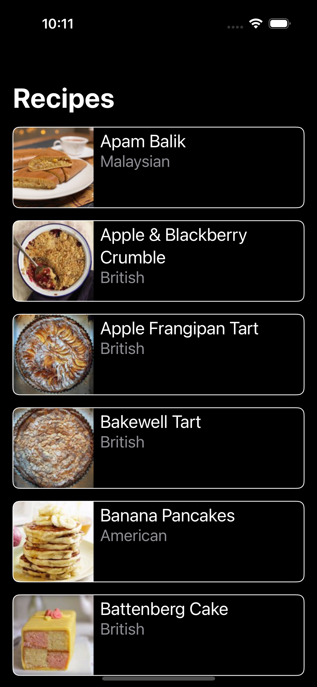
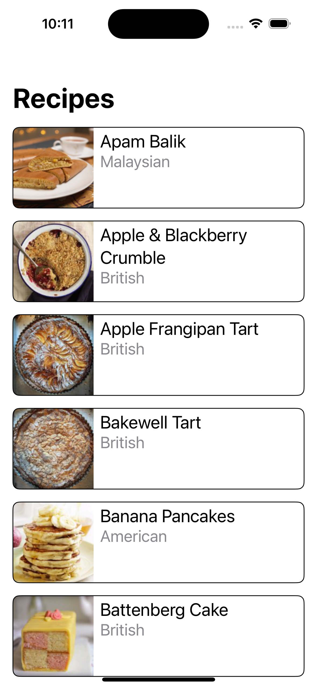

### Summary:
This app hits a recipes API and displays those recipes in a list

### Focus Areas:
I spent a large portion of my time trying to make the various layers of my app as reusable as possible. This enables quicker development for future features and greater maintainability.

### Time Spent: 
I spent a total of about 4 hours on this project. About 1.5 hours was spent on the data/domain layer. 2 hours was spent on the UI layer, including the RemoteImage component. An additional half hour was spent on unit tests.

### Trade-offs and Decisions:
Since I invested more time in separation of concerns and reusability, I didn't have as much time to invest in polish and additional UX enhancements.

### Weakest Part of the Project:
I would've liked to refine the error handling a bit further, but was unable to do so due to time constraints
